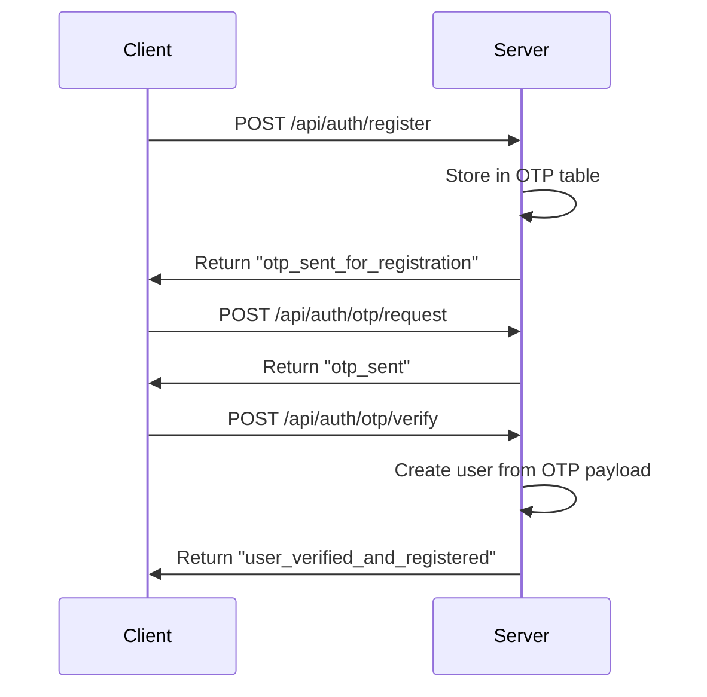
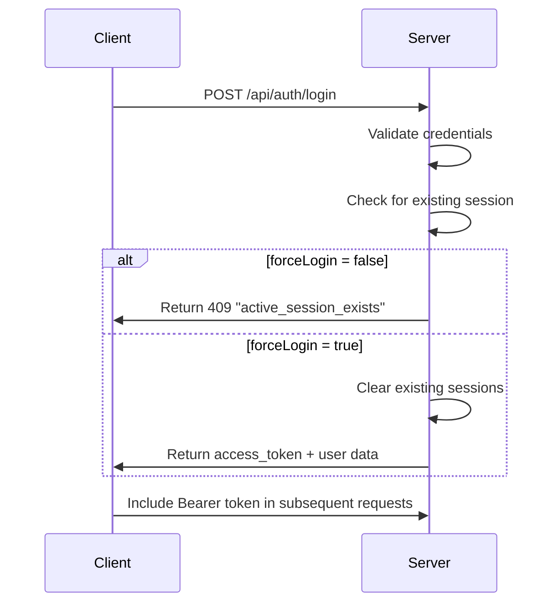
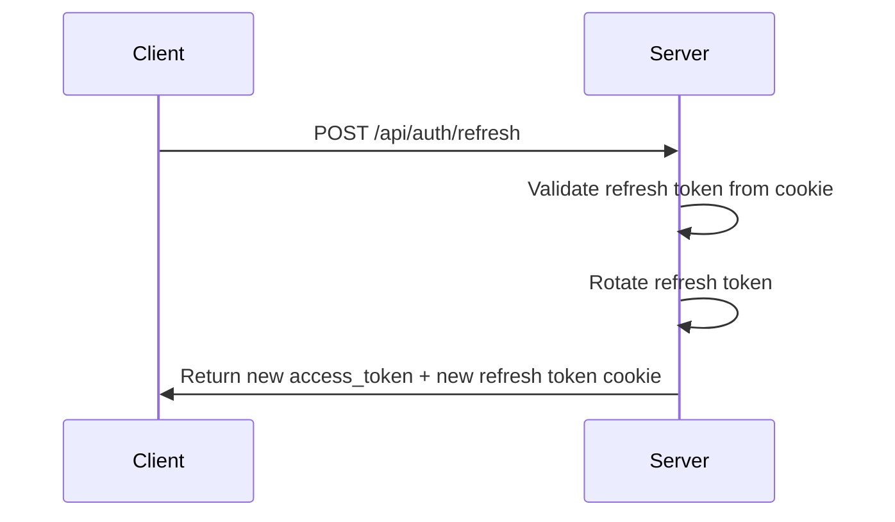
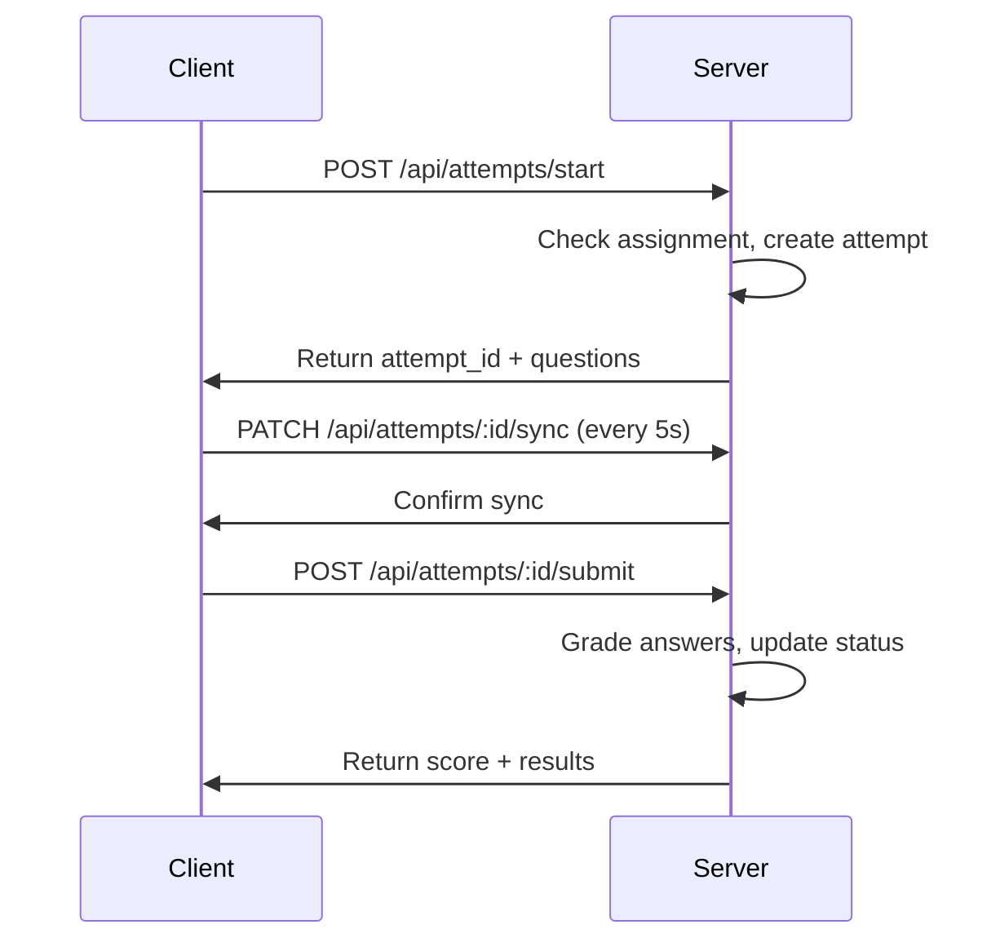

# 🎯 Quiz System API Documentation

## 📋 Table of Contents
1. [Authentication](#authentication)
2. [User Management](#user-management)
3. [Question Management](#question-management)
4. [Quiz Management](#quiz-management)
5. [Assignment Management](#assignment-management)
6. [Quiz Attempts](#quiz-attempts)
7. [Student Routes](#student-routes)
8. [Health Check](#health-check)
9. [Error Codes](#error-codes)
10. [Data Models](#data-models)

---

## 🔐 Authentication

### Base URL
```
http://localhost:3000/api
```

### Authentication Headers
All authenticated endpoints require:
```
Authorization: Bearer <access_token>
```

### JWT Token System
- **Access Token**: Short-lived (15 minutes) for API requests
- **Refresh Token**: Long-lived (7 days) stored in HTTP-only cookies
- **Auto-refresh**: Automatic token renewal via Axios interceptors
- **Single Session**: By default, only one active session per user (use `forceLogin` to override)

---

## 🔑 Authentication Routes (`/api/auth`)

### 1. User Registration
```http
POST /api/auth/register
```

**Request Body:**
```json
{
  "role": "student",
  "name": "John Doe",
  "username": "johndoe",
  "email": "john@example.com",
  "password": "password123",
  "phone": "1234567890",
  "dob": "1990-01-01",
  "gender": "male",
  "school": "Example School",
  "class": "10",
  "section": "A"
}
```

**Validation Rules:**
- `role`: Must be "student" or "teacher"
- `name`: Minimum 3 characters
- `username`: Alphanumeric, minimum 3 characters
- `email`: Valid email format
- `password`: Minimum 8 characters
- `phone`: 10-15 digits, can start with +
- Other fields are optional

**Response:**
```json
{
  "message": "otp_sent_for_registration"
}
```

**Note:** Registration requires OTP verification. The user data is stored temporarily and will be created only after OTP verification.

### 2. Request/Resend OTP
```http
POST /api/auth/otp/request
```

**Request Body:**
```json
{
  "phone": "1234567890",
  "purpose": "register"
}
```

**Validation Rules:**
- `phone`: Exactly 10 digits
- `purpose`: Optional (defaults to "register")

**Response:**
```json
{
  "message": "otp_sent"
}
```

**Error Responses:**
- `400`: `phone_required`
- `404`: `pending_registration_not_found` (for register purpose)
- `404`: `user_not_found` (for other purposes)

### 3. Verify OTP
```http
POST /api/auth/otp/verify
```

**Request Body:**
```json
{
  "phone": "1234567890",
  "otp": "123456",
  "purpose": "register"
}
```

**Validation Rules:**
- `phone`: Exactly 10 digits
- `otp`: Required string
- `purpose`: Optional (defaults to "register")

**Response (Registration):**
```json
{
  "message": "user_verified_and_registered",
  "user_id": 1
}
```

**Response (Other purposes):**
```json
{
  "message": "otp_verified"
}
```

**Error Responses:**
- `400`: `invalid_or_expired_otp`
- `400`: `otp_expired`
- `500`: `registration_payload_missing`

### 4. User Login
```http
POST /api/auth/login
```

**Request Body:**
```json
{
  "phone": "1234567890",
  "username": "johndoe",
  "password": "password123",
  "forceLogin": false
}
```

**Validation Rules:**
- Must provide either `phone` OR `username` (not both)
- `phone`: Exactly 10 digits
- `username`: Alphanumeric, minimum 3 characters
- `password`: Required
- `forceLogin`: Optional boolean (defaults to false)

**Response:**
```json
{
  "accessToken": "eyJhbGciOiJIUzI1NiIsInR5cCI6IkpXVCJ9...",
  "user": {
    "id": 1,
    "role": "student",
    "username": "johndoe",
    "name": "John Doe",
    "email": "john@example.com",
    "phone": "1234567890",
    "verification_status": true,
    "user_state": "active",
    "created_at": "2025-01-15T10:30:00Z"
  }
}
```

**Error Responses:**
- `400`: `phone_or_username_required`
- `401`: `invalid_credentials`
- `404`: `user_not_found`
- `409`: `active_session_exists` (when `forceLogin` is false)

**Note:** By default, only one active session is allowed per user. Use `forceLogin: true` to terminate existing sessions and create a new one.

### 5. User Logout
```http
POST /api/auth/logout
```

**Response:**
```json
{
  "message": "logged_out"
}
```

**Note:** Clears the refresh token cookie and removes the token from the database.

### 6. Refresh Access Token
```http
POST /api/auth/refresh
```

**Response:**
```json
{
  "accessToken": "eyJhbGciOiJIUzI1NiIsInR5cCI6IkpXVCJ9...",
  "user": {
    "id": 1,
    "role": "student",
    "username": "johndoe"
  }
}
```

**Error Responses:**
- `401`: `no_refresh_token`
- `401`: `invalid_refresh_token`
- `401`: `refresh_token_expired`
- `404`: `user_not_found`

**Note:** Uses the refresh token from HTTP-only cookies. Automatically rotates the refresh token for security.

---

## 👥 User Management (`/api/users`)

### 1. Get Current User Profile
```http
GET /api/users/me
```

**Response:**
```json
{
  "id": 1,
  "role": "student",
  "name": "John Doe",
  "username": "johndoe",
  "email": "john@example.com",
  "dob": "1990-01-01",
  "gender": "male",
  "school": "Example School",
  "class": "10",
  "section": "A",
  "phone": "1234567890",
  "verification_status": true,
  "user_state": "active",
  "created_at": "2025-01-15T10:30:00Z",
  "updated_at": "2025-01-15T10:30:00Z"
}
```

### 2. Update Current User Profile
```http
PUT /api/users/me
```

**Request Body:**
```json
{
  "name": "John Updated",
  "email": "john.updated@example.com",
  "phone": "1234567891"
}
```

**Response:**
```json
{
  "message": "profile_updated",
  "user": {
    "id": 1,
    "name": "John Updated",
    "email": "john.updated@example.com"
  }
}
```

### 3. List All Users (Admin Only)
```http
GET /api/users
```

**Response:**
```json
[
  {
    "id": 1,
    "role": "student",
    "name": "John Doe",
    "username": "johndoe",
    "email": "john@example.com",
    "dob": "1990-01-01",
    "gender": "male",
    "school": "Example School",
    "class": "10",
    "section": "A",
    "phone": "1234567890",
    "verification_status": true,
    "user_state": "active",
    "created_at": "2025-01-15T10:30:00Z",
    "updated_at": "2025-01-15T10:30:00Z"
  }
]
```

### 4. Get User by ID (Admin/Owner)
```http
GET /api/users/:id
```

**Response:**
```json
{
  "id": 1,
  "role": "student",
  "name": "John Doe",
  "username": "johndoe",
  "email": "john@example.com",
  "dob": "1990-01-01",
  "gender": "male",
  "school": "Example School",
  "class": "10",
  "section": "A",
  "phone": "1234567890",
  "verification_status": true,
  "user_state": "active",
  "created_at": "2025-01-15T10:30:00Z",
  "updated_at": "2025-01-15T10:30:00Z"
}
```

**Error Responses:**
- `400`: `invalid_id`
- `403`: `forbidden`
- `404`: `not_found`

### 5. Create User (Admin Only)
```http
POST /api/users
```

**Request Body:**
```json
{
  "name": "Jane Doe",
  "username": "janedoe",
  "email": "jane@example.com",
  "password": "password123",
  "role": "teacher",
  "phone": "1234567890"
}
```

**Response:**
```json
{
  "message": "user_created",
  "user": {
    "id": 2,
    "name": "Jane Doe",
    "username": "janedoe",
    "role": "teacher"
  }
}
```

### 6. Update User (Admin Only)
```http
PUT /api/users/:id
```

**Request Body:**
```json
{
  "name": "Jane Updated",
  "role": "admin"
}
```

**Response:**
```json
{
  "message": "user_updated"
}
```

### 7. Delete User (Admin Only)
```http
DELETE /api/users/:id
```

**Response:**
```json
{
  "message": "user_deleted"
}
```

---

## ❓ Question Management (`/api/questions`)

### 1. List All Questions
```http
GET /api/questions
```

**Response:**
```json
[
  {
    "id": 1,
    "question_text": "What is 2 + 2?",
    "question_type": "mcq",
    "options": [
      {"id": "a", "text": "3"},
      {"id": "b", "text": "4"},
      {"id": "c", "text": "5"}
    ],
    "correct_answers": ["b"],
    "time_limit": 30,
    "difficulty": "easy",
    "tags": ["math", "basic"],
    "created_by": 2,
    "created_at": "2025-01-15T10:30:00Z",
    "updated_at": "2025-01-15T10:30:00Z"
  }
]
```

### 2. Get Question by ID
```http
GET /api/questions/:id
```

**Response:**
```json
{
  "id": 1,
  "question_text": "What is 2 + 2?",
  "question_type": "mcq",
  "options": [
    {"id": "a", "text": "3"},
    {"id": "b", "text": "4"},
    {"id": "c", "text": "5"}
  ],
  "correct_answers": ["b"],
  "time_limit": 30,
  "difficulty": "easy",
  "tags": ["math", "basic"],
  "created_by": 2,
  "created_at": "2025-01-15T10:30:00Z",
  "updated_at": "2025-01-15T10:30:00Z"
}
```

**Error Responses:**
- `404`: `not_found`

### 3. Create Question (Teacher/Admin)
```http
POST /api/questions
```

**Request Body:**
```json
{
  "question_text": "What is the capital of France?",
  "question_type": "mcq",
  "options": [
    {"id": "a", "text": "Paris"},
    {"id": "b", "text": "London"},
    {"id": "c", "text": "Berlin"}
  ],
  "correct_answers": ["a"],
  "time_limit": 30,
  "difficulty": "easy",
  "tags": ["geography"]
}
```

**Validation Rules:**
- `question_text`: Required string
- `question_type`: Must be "mcq", "multiple", "truefalse", or "typed"
- `options`: Array of objects with `id` and `text` properties
- `correct_answers`: Array of correct option IDs or text values
- `time_limit`: Optional number (defaults to 0)
- `difficulty`: Optional "easy", "medium", or "hard"
- `tags`: Optional array of strings

**Response:**
```json
{
  "id": 2
}
```

### 4. Create Multiple Questions (Teacher/Admin)
```http
POST /api/questions/bulk
```

**Request Body:**
```json
{
  "questions": [
    {
      "question_text": "Question 1?",
      "question_type": "mcq",
      "options": [{"id": "a", "text": "Option A"}],
      "correct_answers": ["a"]
    },
    {
      "question_text": "Question 2?",
      "question_type": "truefalse",
      "options": [{"id": "a", "text": "True"}, {"id": "b", "text": "False"}],
      "correct_answers": ["a"]
    }
  ]
}
```

**Response:**
```json
{
  "message": "bulk_creation_complete",
  "created": 2,
  "error_count": 0,
  "results": [
    {"index": 0, "id": 3, "success": true},
    {"index": 1, "id": 4, "success": true}
  ],
  "errors": []
}
```

**Error Response Example:**
```json
{
  "message": "bulk_creation_complete",
  "created": 1,
  "error_count": 1,
  "results": [
    {"index": 0, "id": 3, "success": true}
  ],
  "errors": [
    {"index": 1, "error": "invalid_question_type"}
  ]
}
```

### 5. Update Question (Teacher/Admin)
```http
PUT /api/questions/:id
```

**Request Body:**
```json
{
  "question_text": "Updated question text",
  "difficulty": "medium"
}
```

**Response:**
```json
{
  "message": "updated"
}
```

**Error Responses:**
- `400`: `no_fields`
- `404`: `not_found`

### 6. Delete Question (Teacher/Admin)
```http
DELETE /api/questions/:id
```

**Response:**
```json
{
  "message": "deleted"
}
```

---

## 📝 Quiz Management (`/api/quizzes`)

### 1. List All Quizzes
```http
GET /api/quizzes
```

**Response:**
```json
[
  {
    "id": 1,
    "title": "Math Basics Quiz",
    "description": "A simple arithmetic quiz",
    "total_time": 600,
    "quiz_type": "anytime",
    "scheduled_at": null,
    "image_url": "https://example.com/math.png",
    "difficulty": "easy",
    "tags": ["math", "basic"],
    "created_by": 2,
    "creator": "teacher1",
    "created_at": "2025-01-15T10:30:00Z",
    "updated_at": "2025-01-15T10:30:00Z"
  }
]
```

### 2. Get Quiz by ID
```http
GET /api/quizzes/:id
```

**Response:**
```json
{
  "id": 1,
  "title": "Math Basics Quiz",
  "description": "A simple arithmetic quiz",
  "total_time": 600,
  "quiz_type": "anytime",
  "scheduled_at": null,
  "image_url": "https://example.com/math.png",
  "difficulty": "easy",
  "tags": ["math", "basic"],
  "created_by": 2,
  "created_at": "2025-01-15T10:30:00Z",
  "updated_at": "2025-01-15T10:30:00Z",
  "questions": [
    {
      "position": 1,
      "id": 1,
      "question_text": "What is 2 + 2?",
      "question_type": "mcq",
      "options": [{"id": "a", "text": "3"}, {"id": "b", "text": "4"}],
      "correct_answers": ["b"]
    }
  ]
}
```

**Error Responses:**
- `404`: `not_found`

### 3. Create Quiz (Teacher/Admin)
```http
POST /api/quizzes
```

**Request Body:**
```json
{
  "title": "Science Quiz",
  "description": "Basic science questions",
  "total_time": 900,
  "quiz_type": "scheduled",
  "scheduled_at": "2025-01-20T14:00:00Z",
  "image_url": "https://example.com/science.png",
  "difficulty": "medium",
  "tags": ["science", "general"]
}
```

**Validation Rules:**
- `title`: Required string
- `description`: Optional string
- `total_time`: Optional number (seconds)
- `quiz_type`: Must be "anytime" or "scheduled"
- `scheduled_at`: Required date if quiz_type is "scheduled"
- `image_url`: Optional valid URL
- `difficulty`: Optional "easy", "medium", or "hard"
- `tags`: Optional array of strings

**Response:**
```json
{
  "id": 2
}
```

### 4. Update Quiz (Teacher/Admin)
```http
PUT /api/quizzes/:id
```

**Request Body:**
```json
{
  "title": "Updated Quiz Title",
  "description": "Updated description"
}
```

**Response:**
```json
{
  "message": "updated"
}
```

**Error Responses:**
- `400`: `no_fields`
- `404`: `not_found`

### 5. Delete Quiz (Teacher/Admin)
```http
DELETE /api/quizzes/:id
```

**Response:**
```json
{
  "message": "deleted"
}
```

### 6. Set Quiz Questions (Teacher/Admin)
```http
POST /api/quizzes/:id/questions
```

**Request Body:**
```json
{
  "question_ids": [1, 2, 3, 4, 5]
}
```

**Validation Rules:**
- `question_ids`: Required array of question IDs

**Response:**
```json
{
  "message": "questions_assigned"
}
```

**Error Responses:**
- `400`: `question_ids_array_required`

**Note:** This replaces all existing questions for the quiz. The questions will be ordered by the array order.

---

## 📋 Assignment Management (`/api/assignments`)

### 1. Assign Quiz to Students (Teacher/Admin)
```http
POST /api/assignments
```

**Request Body:**
```json
{
  "quiz_id": 1,
  "student_ids": [1, 2, 3, 4],
  "due_at": "2025-01-25T23:59:59Z"
}
```

**Validation Rules:**
- `quiz_id`: Required number
- `student_ids`: Required non-empty array of student IDs
- `due_at`: Optional date

**Response:**
```json
{
  "message": "assignment_complete",
  "assigned_count": 4,
  "skipped": []
}
```

**Error Responses:**
- `400`: `quiz_id and a non-empty student_ids array are required`

**Note:** If a student is already assigned to the quiz, they will be skipped.

### 2. Deassign Quiz (Teacher/Admin)
```http
POST /api/assignments/deassign
```

**Request Body:**
```json
{
  "quiz_id": 1,
  "student_id": 1
}
```

**Response:**
```json
{
  "message": "deassigned"
}
```

**Note:** Changes assignment status to "revoked" instead of deleting.

### 3. Get My Assignments (Student)
```http
GET /api/assignments/my
```

**Response:**
```json
[
  {
    "assignment_id": 1,
    "assigned_at": "2025-01-15T10:30:00Z",
    "updated_at": "2025-01-15T10:30:00Z",
    "due_at": "2025-01-25T23:59:59Z",
    "status": "assigned",
    "attempt_id": null,
    "quiz": {
      "id": 1,
      "title": "Math Basics Quiz",
      "description": "A simple arithmetic quiz",
      "total_time": 600,
      "quiz_type": "anytime",
      "scheduled_at": null,
      "image_url": "https://example.com/math.png",
      "total_marks": 5
    }
  }
]
```

### 4. List All Assignments (Teacher/Admin)
```http
GET /api/assignments?includeRevoked=false
```

**Query Parameters:**
- `includeRevoked`: Optional boolean (defaults to false)

**Response:**
```json
[
  {
    "id": 1,
    "quiz_id": 1,
    "student_id": 1,
    "assigned_by": 2,
    "assigned_at": "2025-01-15T10:30:00Z",
    "due_at": "2025-01-25T23:59:59Z",
    "status": "assigned",
    "updated_at": "2025-01-15T10:30:00Z",
    "title": "Math Basics Quiz",
    "student": "johndoe"
  }
]
```

### 5. Get Assignments for Quiz (Teacher/Admin)
```http
GET /api/assignments/quiz/:quizId?includeRevoked=false
```

**Query Parameters:**
- `includeRevoked`: Optional boolean (defaults to false)

**Response:**
```json
[
  {
    "id": 1,
    "student": {
      "id": 1,
      "name": "John Doe",
      "username": "johndoe",
      "email": "john@example.com",
      "school": "Example School",
      "class": "10",
      "section": "A"
    },
    "assigned_by": {
      "id": 2,
      "name": "Jane Teacher",
      "username": "janeteacher"
    },
    "status": "assigned",
    "due_at": "2025-01-25T23:59:59Z",
    "assigned_at": "2025-01-15T10:30:00Z"
  }
]
```

---

## 🎯 Quiz Attempts (`/api/attempts`)

### 1. Start New Attempt (Student)
```http
POST /api/attempts/start
```

**Request Body:**
```json
{
  "quiz_id": 1
}
```

**Response:**
```json
{
  "attempt_id": 1,
  "quiz": {
    "id": 1,
    "title": "Math Basics Quiz",
    "description": "A simple arithmetic quiz"
  },
  "questions": [
    {
      "id": 1,
      "question_text": "What is 2 + 2?",
      "question_type": "mcq",
      "options": [
        {"id": "a", "text": "3"},
        {"id": "b", "text": "4"},
        {"id": "c", "text": "5"}
      ],
      "answer": null
    }
  ]
}
```

**Error Responses:**
- `403`: `quiz_not_assigned`
- `400`: `attempt_already_in_progress` (with `attempt_id`)
- `400`: `quiz_already_completed` (with `attempt_id`)
- `404`: `quiz_not_found`

**Note:** 
- Automatically updates assignment status to "in_progress"
- Questions are returned without correct answers
- Each question has `answer: null` initially

### 2. Sync Attempt State (Student)
```http
PATCH /api/attempts/:id/sync
```

**Request Body:**
```json
{
  "state": {
    "quiz_id": 1,
    "questions": [
      {
        "id": 1,
        "question_text": "What is 2 + 2?",
        "question_type": "mcq",
        "options": [
          {"id": "a", "text": "3"},
          {"id": "b", "text": "4"},
          {"id": "c", "text": "5"}
        ],
        "answer": "b"
      }
    ]
  }
}
```

**Response:**
```json
{
  "message": "attempt_synced"
}
```

**Error Responses:**
- `404`: `attempt_not_found`
- `403`: `forbidden` (wrong student)
- `400`: `attempt_not_in_progress`

**Note:** 
- Updates `last_synced_at` timestamp
- Only accepts sync for attempts with "in_progress" status
- Student can only sync their own attempts

### 3. Submit Attempt (Student)
```http
POST /api/attempts/:id/submit
```

**Response:**
```json
{
  "score": 100,
  "total_questions": 5,
  "correct": 5
}
```

**Error Responses:**
- `404`: `attempt_not_found`
- `403`: `forbidden` (wrong student)
- `400`: `no_questions_found`

**Note:** 
- Automatically grades all questions
- Updates assignment status to "completed"
- Sets attempt status to "submitted"
- Returns score as percentage (0-100)

### 4. Get My Attempts (Student)
```http
GET /api/attempts/my
```

**Response:**
```json
[
  {
    "id": 1,
    "quiz_id": 1,
    "started_at": "2025-01-15T10:30:00Z",
    "finished_at": "2025-01-15T10:45:00Z",
    "score": "100",
    "status": "submitted",
    "state": {
      "quiz_id": 1,
      "questions": [...]
    }
  }
]
```

### 5. Get Attempt Details (Student/Teacher/Admin)
```http
GET /api/attempts/:id
```

**Response:**
```json
{
  "id": 1,
  "quiz_id": 1,
  "student_id": 1,
  "started_at": "2025-01-15T10:30:00Z",
  "finished_at": "2025-01-15T10:45:00Z",
  "state": {
    "quiz_id": 1,
    "questions": [
      {
        "id": 1,
        "answer": "b",
        "options": [
          {"id": "a", "text": "3"},
          {"id": "b", "text": "4"},
          {"id": "c", "text": "5"}
        ],
        "question_text": "What is 2 + 2?",
        "question_type": "mcq",
        "correct_answers": ["b"]
      }
    ]
  },
  "score": "100",
  "status": "submitted",
  "last_synced_at": "2025-01-15T10:44:30Z"
}
```

**Error Responses:**
- `404`: `not_found`
- `403`: `forbidden` (student trying to access another student's attempt)

**Note:** 
- For submitted attempts, includes `correct_answers` for review
- Students can only see their own attempts
- Teachers/Admins can see any attempt

### 6. Reset Attempt (Teacher/Admin)
```http
POST /api/attempts/reset
```

**Request Body:**
```json
{
  "student_id": 1,
  "quiz_id": 1
}
```

**Response:**
```json
{
  "message": "attempts_reset"
}
```

**Error Responses:**
- `404`: `quiz_not_found`

**Note:** Deletes all attempts for the specified student and quiz combination.

---

## 👨‍🎓 Student Routes (`/api/student`)

### 1. Get My Assignments (Student)
```http
GET /api/student/assignments
```

**Response:**
```json
[
  {
    "assignment_id": 1,
    "quiz": {
      "id": 1,
      "title": "Math Basics Quiz",
      "description": "A simple arithmetic quiz"
    },
    "status": "assigned",
    "attempt_id": null
  }
]
```

---

## 🏥 Health Check (`/api/health`)

### 1. Health Check
```http
GET /api/health
```

**Response:**
```json
{
  "status": "ok",
  "timestamp": "2025-01-15T10:30:00Z"
}
```

---

## ❌ Error Codes

### Common Error Responses

#### 400 Bad Request
```json
{
  "error": "validation_error",
  "details": "Field 'email' is required"
}
```

#### 401 Unauthorized
```json
{
  "error": "unauthorized",
  "message": "Invalid or expired token"
}
```

#### 403 Forbidden
```json
{
  "error": "forbidden",
  "message": "Insufficient permissions"
}
```

#### 404 Not Found
```json
{
  "error": "not_found",
  "message": "Resource not found"
}
```

#### 409 Conflict
```json
{
  "error": "conflict",
  "message": "Resource already exists"
}
```

#### 500 Internal Server Error
```json
{
  "error": "internal_error",
  "message": "Something went wrong"
}
```

### Authentication-Specific Error Codes

#### Registration Errors
```json
{
  "error": "role_must_be_student_or_teacher"
}
```

```json
{
  "error": "user_already_exists"
}
```

#### Login Errors
```json
{
  "error": "phone_or_username_required"
}
```

```json
{
  "error": "invalid_credentials"
}
```

```json
{
  "error": "active_session_exists"
}
```

#### OTP Errors
```json
{
  "error": "phone_required"
}
```

```json
{
  "error": "pending_registration_not_found"
}
```

```json
{
  "error": "invalid_or_expired_otp"
}
```

```json
{
  "error": "otp_expired"
}
```

### Quiz-Specific Error Codes

#### Quiz Not Assigned
```json
{
  "error": "quiz_not_assigned"
}
```

#### Attempt Already in Progress
```json
{
  "error": "attempt_already_in_progress",
  "attempt_id": 1
}
```

#### Quiz Already Completed
```json
{
  "error": "quiz_already_completed",
  "attempt_id": 1
}
```

#### Attempt Not in Progress
```json
{
  "error": "attempt_not_in_progress"
}
```

#### Attempt Not Found
```json
{
  "error": "attempt_not_found"
}
```

#### No Questions Found
```json
{
  "error": "no_questions_found"
}
```

### Question-Specific Error Codes

#### Invalid Question Type
```json
{
  "error": "invalid_question_type"
}
```

#### Missing Required Fields
```json
{
  "error": "missing_required_fields"
}
```

#### Questions Array Required
```json
{
  "error": "questions_array_required"
}
```

### Assignment-Specific Error Codes

#### Invalid Assignment Request
```json
{
  "error": "quiz_id and a non-empty student_ids array are required"
}
```

---

## 📊 Data Models

### User Model
```json
{
  "id": 1,
  "role": "student|teacher|admin",
  "name": "John Doe",
  "username": "johndoe",
  "email": "john@example.com",
  "dob": "1990-01-01",
  "gender": "male|female|other",
  "school": "Example School",
  "class": "10",
  "section": "A",
  "phone": "1234567890",
  "verification_status": true,
  "user_state": "active|inactive|suspended",
  "created_at": "2025-01-15T10:30:00Z",
  "updated_at": "2025-01-15T10:30:00Z"
}
```

### Quiz Model
```json
{
  "id": 1,
  "title": "Math Basics Quiz",
  "description": "A simple arithmetic quiz",
  "total_time": 600,
  "quiz_type": "anytime|scheduled",
  "scheduled_at": "2025-01-20T14:00:00Z",
  "image_url": "https://example.com/math.png",
  "difficulty": "easy|medium|hard",
  "tags": ["math", "basic"],
  "created_by": 2,
  "created_at": "2025-01-15T10:30:00Z",
  "updated_at": "2025-01-15T10:30:00Z"
}
```

### Question Model
```json
{
  "id": 1,
  "question_text": "What is 2 + 2?",
  "question_type": "mcq|multiple|truefalse|typed",
  "options": [
    {"id": "a", "text": "3"},
    {"id": "b", "text": "4"},
    {"id": "c", "text": "5"}
  ],
  "correct_answers": ["b"],
  "time_limit": 30,
  "difficulty": "easy|medium|hard",
  "tags": ["math", "basic"],
  "created_by": 2,
  "created_at": "2025-01-15T10:30:00Z",
  "updated_at": "2025-01-15T10:30:00Z"
}
```

### Attempt Model
```json
{
  "id": 1,
  "quiz_id": 1,
  "student_id": 1,
  "started_at": "2025-01-15T10:30:00Z",
  "finished_at": "2025-01-15T10:45:00Z",
  "state": {
    "quiz_id": 1,
    "questions": [
      {
        "id": 1,
        "answer": "b",
        "options": [{"id": "a", "text": "3"}, {"id": "b", "text": "4"}],
        "question_text": "What is 2 + 2?",
        "question_type": "mcq",
        "correct_answers": ["b"]
      }
    ]
  },
  "score": "100",
  "status": "in_progress|submitted",
  "last_synced_at": "2025-01-15T10:44:30Z"
}
```

### Assignment Model
```json
{
  "id": 1,
  "quiz_id": 1,
  "student_id": 1,
  "assigned_by": 2,
  "assigned_at": "2025-01-15T10:30:00Z",
  "due_at": "2025-01-25T23:59:59Z",
  "status": "assigned|revoked|completed|in_progress",
  "updated_at": "2025-01-15T10:30:00Z"
}
```

---

## 🔧 Authentication Flow

### 1. Registration Flow


### 2. Login Flow


### 3. Token Refresh Flow


### 4. Quiz Attempt Flow


---

## 📝 Notes

### Rate Limiting
- Authentication endpoints: 5 requests per minute
- API endpoints: 100 requests per minute

### File Uploads
- Maximum file size: 2MB
- Supported formats: JPG, PNG, GIF

### Pagination
- Default limit: 20 items per page
- Use `?page=1&limit=10` for pagination

### Filtering
- Use query parameters for filtering: `?role=student&status=active`
- Date ranges: `?created_after=2025-01-01&created_before=2025-01-31`

### Sorting
- Use `?sort=created_at&order=desc` for sorting
- Default sort: `created_at DESC`

### Security Features
- **Single Session**: By default, only one active session per user
- **Force Login**: Use `forceLogin: true` to terminate existing sessions
- **Token Rotation**: Refresh tokens are automatically rotated on each refresh
- **HTTP-Only Cookies**: Refresh tokens stored in secure HTTP-only cookies
- **Role-Based Access**: Strict role-based access control for all endpoints

### Quiz Attempt Features
- **Auto-Grading**: Automatic grading on submission
- **State Sync**: Periodic state synchronization during attempts
- **Resume Support**: Ability to resume interrupted attempts
- **Timer Support**: Built-in timer functionality (30 seconds per question)
- **Answer Validation**: Proper handling of different question types

### Data Validation
- **Joi Schemas**: Comprehensive validation for all inputs
- **Type Checking**: Proper type validation for all fields
- **Required Fields**: Clear validation for required vs optional fields
- **Format Validation**: Email, phone, date format validation

---

*This documentation covers all API endpoints in the Quiz System with complete request/response formats, validation rules, error codes, and implementation details. For additional support, please refer to the backend source code or contact the development team.*
